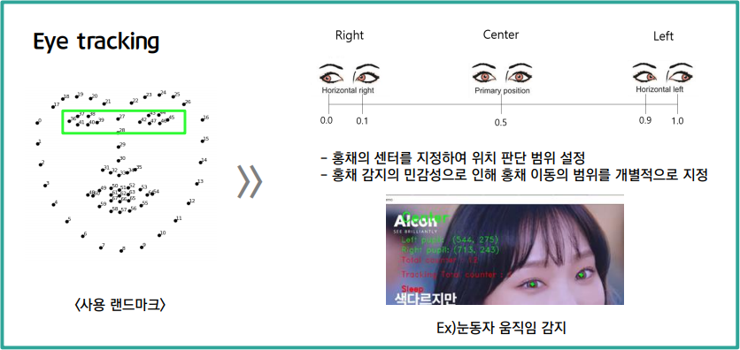
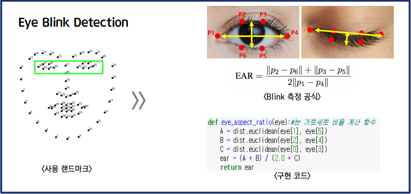
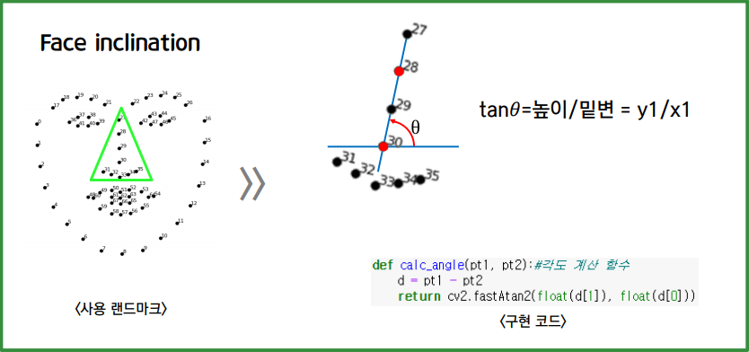

# 졸음 판별기(Sleep – Detector)
## 프로젝트 계획이유
> 코로나19로 인한 온라인 비대면 교육의 증가로 인한 학습 집중도 감소가 우려됨  
> 따라서, 학습 성취도 함양을 위한 학습 보조 자료를 제공하고자 함
## 사용 기술
- dlib
- OpenCV
- 랜드마크
## 기능 설명
### 1. Eye tracking

### 2. Eye Blink Detection

### 3. Face inclination

